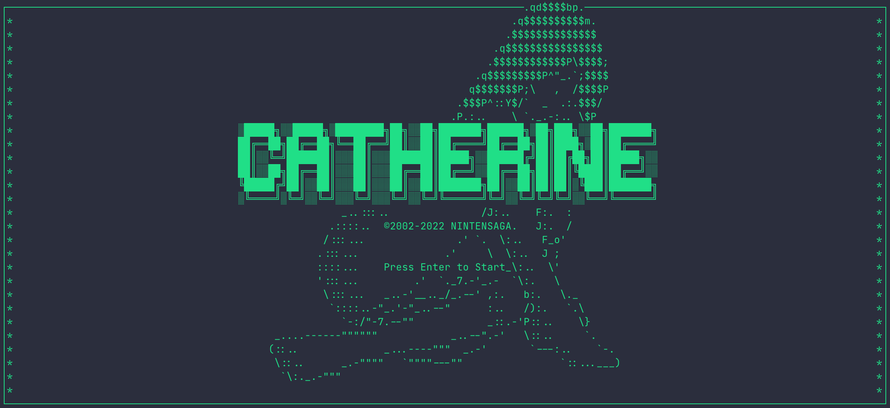

# Catherine 👠

A simple TUI block-pushing game.

## 1. Introduction 🤔

This game was first written in C in my freshman year (2020).

Recently, to back up my pre-GitHub projects, I dug it out again. But besides putting the original one in my repo, I also decided to rewrite it in Go to get more familiar with the language.

### Why Catherine? 

Well, it’s named after the game *Catherine* (Atlus, 2011), and even the name of the hero and the background story of mine are the same as its. 

This is mainly because *Catherine* is the first game I can call to mind when thinking about a block-pushing game (though I wrote the game in plain TUI 2D).

## 2. Build & Run 🛠

The build scripts of both versions are written in Makefile.

### [Root](.)

| Target   | Description        |
| -------- | ------------------ |
| `run_go` | Build and run the Go version. |
| `run_c`  | Build and run the C version.  |

### [C Version](./c_version/) / [Go Version](./go_version/)

| Target            | Description    |
| ----------------- | -------------- |
| `(default) / all` | Build only. |
| `run`             | Build and run the game.   |

## 3. Demo 🎥

https://user-images.githubusercontent.com/72867349/180706054-056b555d-18f2-461a-8fa6-7ded9fef1b40.mov
